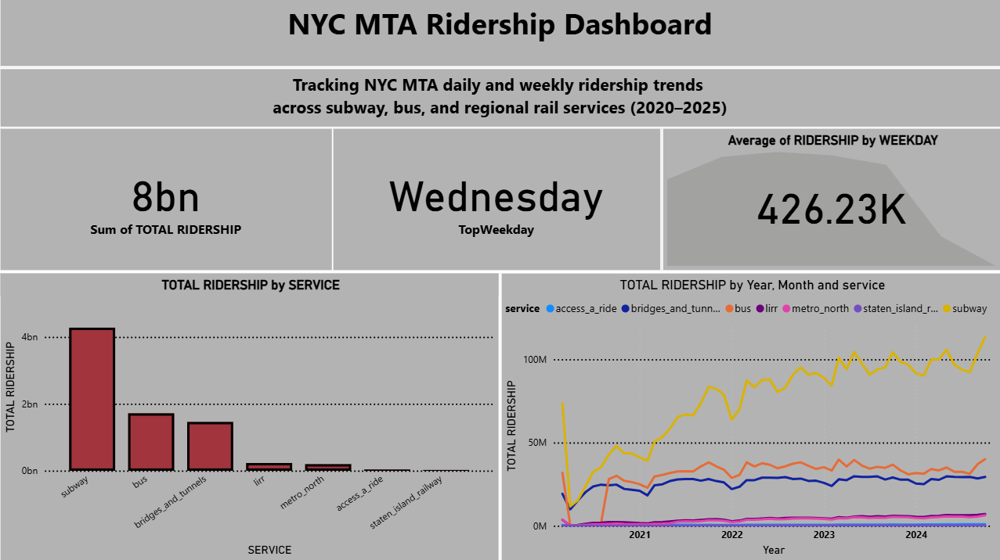

# NYC MTA Ridership Analysis

A fully reproducible data pipeline and Power BI dashboard to analyze daily ridership trends across New York City’s MTA systems. The project covers data ingestion, transformation, testing, analysis, and visualization using dbt, DuckDB, Python, and Power BI.

## Tech Stack

- dbt (with DuckDB as the engine)  
- Python (pandas, matplotlib, seaborn, duckdb)  
- Power BI (for final dashboard)  
- Git (version control)

## Project Structure

```
NYC MTA Ridership Analysis/
├── data_raw/               # Original CSV file from Maven Analytics
├── nyc_mta_ridership/      # dbt project (staging, marts, tests)
├── notebooks/              # Cleaning, analysis, and export
│   ├── 01_cleaning_exploration.ipynb
│   ├── 02_analysis.ipynb
│   └── 03_export_csv.ipynb
├── outputs/                # Final CSVs for Power BI
├── reports/                # Power BI .pbix and screenshots
├── requirements.txt        # Python dependencies
├── .gitignore              # Excludes .duckdb, target/, checkpoints, etc.
├── README.md               # This file
└── dev.duckdb              # DuckDB database file
```

## Pipeline Summary

1. **Raw Data Cleaning**  
   Cleaned in Python using pandas.  
   Derived fields: `weekday`, `is_weekend`, `% change vs 2019`, outliers.  
   Notebook: `01_cleaning_exploration.ipynb`

2. **Exploratory Analysis**  
   Quick analysis and plots using dbt marts (`mrt_*`).  
   Notebook: `02_analysis.ipynb`  
   Includes:
   - Monthly ridership evolution
   - Weekday averages
   - Outlier inspection

3. **Transformation with dbt**  
   - `stg_mta_daily_ridership`: staging model with cleaned fields  
   - `stg_mta_daily_ridership_long`: pivoted into long format by service  
   - Marts:
     - `mrt_daily_summary`: daily totals per service
     - `mrt_weekday_patterns`: average by weekday
     - `mrt_service_trends`: monthly trends per service
     - `mrt_anomaly_flags`: 3σ outlier detection

4. **Testing**  
   - Tests applied: `not_null`, `unique`, `accepted_values`, custom logic  
   - Executed with `dbt test`

5. **Export for BI**  
   - Notebook: `03_export_csv.ipynb`  
   - Final marts exported to CSV (`outputs/`)

6. **Dashboard**  
   - Built with Power BI from exported CSVs  
   - Includes KPIs, charts, weekday breakdowns  
   - File: `reports/dashboard.pbix`  
   - Screenshots: `reports/screenshot_1.png`, `screenshot_2.png`


### Dashboard Preview  


Features:
- Total ridership KPIs
- Daily trends by service
- Weekday averages using weekday names
- Evolution over time (monthly)
- Anomaly detection using 3σ thresholds

## How to Run Locally

1. Clone this repository:
   ```
   git clone https://github.com/your-username/nyc-mta-ridership-analysis.git
   cd nyc-mta-ridership-analysis
   ```

2. Create virtual environment and install dependencies:
   ```
   python -m venv venv
   source venv/bin/activate     # or venv\Scripts\activate on Windows
   pip install -r requirements.txt
   ```

3. Run dbt:
   ```
   dbt seed
   dbt run
   dbt test
   ```

4. Open and run the notebooks:
   - `notebooks/01_cleaning_exploration.ipynb`
   - `notebooks/02_analysis.ipynb`
   - `notebooks/03_export_csv.ipynb`

5. Open Power BI:
   - Load `reports/dashboard.pbix`
   - Refresh data from exported CSVs

## Reproducibility Checklist

- [x] Raw data stored in `data_raw/`
- [x] dbt project with staging and marts
- [x] Tests for data quality and anomaly logic
- [x] Jupyter notebooks for cleaning, analysis, and export
- [x] Final output CSVs ready for BI
- [x] Dashboard built in Power BI using exported data
- [x] All setup and execution steps documented
